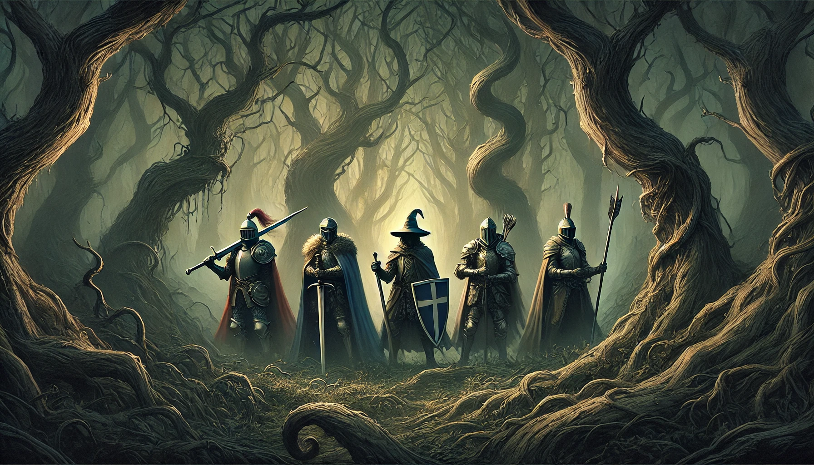

# Test Quest
[Test out the App!](https://testquest.app/)

TestQuest is a hackathon project by two educational web developers who were once teachers:

- Donzo The Wizard ([Github](https://github.com/Donzo), [Devpost](https://devpost.com/mortonteaches)) 
- Tippi The Wingbird ([Github](https://github.com/tippi-fifestarr), [Devpost](https://devpost.com/tippi-fifestarr))

Our goal is to elevate the Learner and Teacher experience with cutting edge AI and blockchain technology. 

**"Set your grade level, pick your topic, learn and then play!"**

## Learn More, Quest

**Most of the relevant code for judges and interested developers lives in the [`/code` folder](./code)** (eg: code/sol/TestQuestApp.sol)

Tippi has embedded readme.md files throughout the codebase along with some easter eggs.

[Smart Contracts Readme here](./code/sol/readme.md) in the `code/readme.md`

## **Inspiration**

In the modern educational landscape, finding effective ways to engage learners and reward their progress is a constant challenge. Traditional methods of standardized testing often fail to capture the true potential of students, and motivating them to learn can be an uphill battle. TestQuest aims to revolutionize this by integrating AI-generated curriculum, gamification, and blockchain technology to create a seamless and rewarding learning experience. Our platform not only incentivizes learning through engaging tests but also rewards students with digital assets that enhance their gameplay, making education both fun and effective.

## **What it does**

TestQuest is a decentralized application that combines AI-generated tests, a fun and challenging game, and blockchain-based rewards to create a unique learning experience. Here's how it works:

1. **Test**: Our AI-generated curriculum provides personalized quizzes that give immediate feedback. If learners score more than 50%, they earn credits to play our game.
2. **Quest**: The game is designed to be fun and challenging, lasting just a few minutes. Players collect digital assets (GOLD) which they can use to purchase equipment, enhancing their gameplay.
3. **Repeat**: This cycle incentivizes continuous learning, as the only way to play the game is by taking tests. Learners receive feedback and can choose their own learning paths, creating an efficient and effective educational system with on-chain verification of their progress.

In the future, we envision custom curriculums created by teachers and custom games to further enhance the learning experience.

## **How we built it**

We built TestQuest using a combination of Donzo the Wizard's expertise, smart contracts, and AI technology:

- **Donzo the Wizard**: Donzo played a crucial role in developing the backend and frontend components, ensuring seamless integration between the AI-generated curriculum and the blockchain-based reward system. He also worked on the game mechanics, making the game engaging and rewarding for learners.
- **Smart Contracts**: The core contracts are written in Solidity and deployed on the Open Campus Codex. We used OpenZeppelin's libraries for AccessControl and ERC1155 standards to manage roles and digital assets.
- **AI-Generated Curriculum**: Our backend generates personalized quizzes using AI, ensuring that each learner receives a unique and challenging test.
- **Game Mechanics**: The game is designed to be engaging and rewarding, with digital assets (GOLD) that can be used to purchase equipment and improve gameplay.

Key contracts include:

- [Gold.sol](https://github.com/Donzo/Test-Quest/blob/main/code/sol/Gold.sol): An ERC20 token representing the in-game currency.
- [Equipment1155.sol](https://github.com/Donzo/Test-Quest/blob/main/code/sol/nft/Equipment1155.sol): An ERC1155 contract for managing equipment items.
- [TestQuestApp.sol](https://github.com/Donzo/Test-Quest/blob/main/code/sol/TestQuestApp.sol): The main application contract that handles user registration, equipment purchases, and tier upgrades.

Donzo's contributions were pivotal in ensuring the smooth operation of the platform, from the backend infrastructure to the engaging game mechanics that keep learners motivated. His work on the PHP-based judges page and other backend components can be seen in files like [view-03e.php](https://github.com/Donzo/Test-Quest/blob/main/code/html/view-03e.php).

## **Challenges we ran into**

One of the main challenges was ensuring seamless integration between the AI-generated curriculum and the blockchain-based reward system. We also had to manage access control effectively, ensuring that only authorized users could interact with certain functions. Additionally, designing a game that is both fun and educational required careful balancing.

## **Accomplishments that we're proud of**

We are proud of successfully integrating AI-generated tests with blockchain-based rewards. Our platform not only makes learning fun but also provides tangible rewards that enhance the gameplay experience. We implemented a robust access control system using OpenZeppelin's libraries and created a decentralized application that securely manages digital assets and user interactions.

## **What we learned**

Throughout the development process, we learned the intricacies of working with AI and blockchain technology. We gained a deeper understanding of Solidity and smart contract development, particularly in managing access control and ensuring secure interactions between on-chain and off-chain components. We also learned about the challenges and best practices in integrating educational content with gamification.

## **What's next for TestQuest**

Next, we plan to expand our platform to support custom curriculums created by teachers and custom games. We aim to enhance the AI-generated tests to provide even more personalized learning experiences. Additionally, we will work on improving the user interface and experience, making it even easier for learners to engage with the platform. We also plan to explore partnerships with other educational games to provide exclusive value and further incentivize learning.

By following this roadmap, we can ensure that TestQuest remains secure, scalable, and user-friendly, providing a valuable platform for learners and teachers alike.

## What's Next for You?

[Try out our app!](https://testquest.app/) and give us feedback!